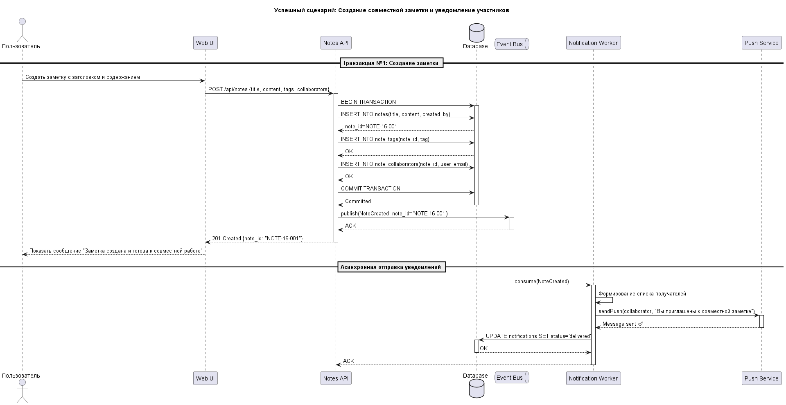
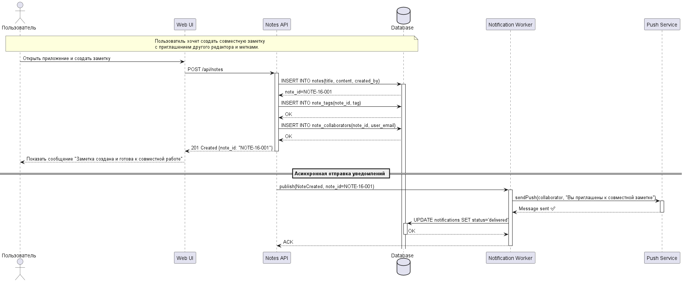

<p align="center">Министерство образования Республики Беларусь</p>
<p align="center">Учреждение образования</p>
<p align="center">"Брестский Государственный технический университет"</p>
<p align="center">Кафедра ИИТ</p>
<br><br><br><br><br><br>
<p align="center"><strong>Лабораторная работа №1</strong></p>
<p align="center"><strong>По дисциплине:</strong> "Проектирование интернет-систем"</p>
<p align="center"><strong>Тема:</strong> "Сценарий транзакции: моделирование use-case и границ ответственности"</p>
<br><br><br><br><br><br>
<p align="right"><strong>Выполнил:</strong></p>
<p align="right">Студент 3 курса</p>
<p align="right">Группы ПО-13</p>
<p align="right">Абрамчук В.Л.</p>
<p align="right"><strong>Проверил:</strong></p>
<p align="right">Шорох Д.В.</p>
<br><br><br><br><br>
<p align="center"><strong>Брест 2026</strong></p>

---

## Цель работы

Научиться анализировать бизнес-процессы интернет-системы, выявлять границы ответственности компонентов и моделировать транзакционные сценарии с учётом возможных сбоев.

---

## Вариант №16 - Заметки «Пишем вдвоём» 📝

**Питч:** Мысли быстрее, чем сообщения.

**Ядро домена:** Тетради, Заметки, Метки, Совместное редактирование, История

---

## Ход выполнения работы

### 1. Структура проекта

```
lab-01/
├── README.md               # Основной отчёт (этот документ)
├── use-case.md             # Текстовое описание use-case
├── diagrams/
│   ├── sequence-happy.puml # PlantUML для успешного сценария
│   ├── sequence-happy.png  # Экспорт диаграммы
│   ├── sequence-error.puml
│   └── sequence-error.png
├── scenarios.feature       # Gherkin-сценарии
└── analysis.md             # Анализ границ ответственности
```

---

### 2. Use-case описание

👉 **Ссылка на файл:** [use-case.md](./use-case.md)

**Основной сценарий:** Создание совместной заметки  
**Первичный актор:** Пользователь (инициатор заметки)  
**Цель:** Создать заметку и поделиться с другим пользователем для совместного редактирования

**Краткое описание основного потока:**

1. Пользователь открывает приложение и выбирает «Создать заметку».
2. Вводит заголовок и текст заметки.
3. Добавляет метки (по необходимости).
4. Приглашает второго пользователя для совместного редактирования.
5. Сохраняет заметку.
6. Система уведомляет второго пользователя о новой заметке.

**Альтернативные потоки:**

- Пользователь отменяет создание заметки → заметка не сохраняется.
- Второй пользователь отклоняет приглашение → заметка остаётся только у инициатора.

**Исключительные ситуации:**

- Ошибка сохранения заметки (например, нет соединения с сервером).
- Некорректные данные в метках или тексте.

---

### 3. Диаграммы последовательности (Sequence Diagrams)

#### 3.1. Happy Path (успешный сценарий)

👉 **PlantUML исходник:** [sequence-happy.puml](diagrams/sequence-happy.puml)  


**Описание потока:**

- Пользователь создаёт заметку → Система проверяет данные → Сохраняет заметку → Отправляет уведомление второму пользователю → Второй пользователь открывает заметку для редактирования

**Участники:**

- Пользователь 1
- Пользователь 2
- Сервис заметок (сервер)
- Сервис уведомлений

#### 3.2. Error Case (сценарий с ошибкой)

👉 **PlantUML исходник:** [sequence-error-notes.puml](diagrams/sequence-error-notes.puml)  


**Описание потока:**

- Ошибка сохранения заметки из-за недоступности сервера → система уведомляет пользователя о сбое → пользователь может повторить попытку

---

### 4. Gherkin-сценарии

👉 **Ссылка на файл:** [scenarios.feature](scenarios.feature)

**Реализовано сценариев:** 4

**Список сценариев:**

1. ✅ **Успешное создание совместной заметки**
2. ✅ **Ошибка при сохранении заметки (сервер недоступен)**
3. ✅ **Ошибка: некорректные метки**
4. ✅ **Ошибка: второй пользователь отклоняет приглашение**

**Пример сценария:**

```gherkin
Feature: Совместное создание заметки

Scenario: Успешное создание совместной заметки
  Given Пользователь 1 авторизован в системе
  When Пользователь 1 создаёт заметку с текстом и метками
  And Приглашает Пользователя 2
  Then Заметка сохраняется на сервере
  And Пользователь 2 получает уведомление о новой заметке
```

---

### 5. Анализ границ ответственности

👉 **Ссылка на файл:** [analysis.md](analysis.md)

#### 5.1. Транзакционные границы

| Операция                         | Синхронная/Асинхронная | Откат при ошибке | Retry-стратегия     | Идемпотентность |
| -------------------------------- | ---------------------- | ---------------- | ------------------- | --------------- |
| Сохранение заметки на сервере    | Синхронная             | Да               | Повтор через 5 сек  | Да              |
| Отправка уведомления             | Асинхронная            | Нет              | Очередь уведомлений | Да              |
| Приглашение второго пользователя | Асинхронная            | Нет              | Повтор через 10 сек | Да              |

#### 5.2. Обработка исключительных ситуаций

**Реализовано стратегий обработки:** 3

##### Исключительная ситуация 1: Ошибка сохранения заметки

- **Условие возникновения:** Сервер недоступен
- **Обнаружение:** Ошибка ответа от сервера
- **Реакция:** Показать сообщение об ошибке
- **Компенсация:** Откат локальных изменений
- **Уведомление пользователя:** «Не удалось сохранить заметку. Попробуйте снова.»

##### Исключительная ситуация 2: Некорректные метки

- **Условие возникновения:** Метки пустые или содержат запрещённые символы
- **Обнаружение:** Проверка на клиенте
- **Реакция:** Блокировка сохранения
- **Компенсация:** Пользователь исправляет метки
- **Уведомление пользователя:** «Некорректные метки. Исправьте перед сохранением.»

##### Исключительная ситуация 3: Второй пользователь отклоняет приглашение

- **Условие возникновения:** Второй пользователь отклоняет приглашение
- **Обнаружение:** Ответ сервера
- **Реакция:** Система сохраняет заметку только у инициатора
- **Компенсация:** Нет необходимости
- **Уведомление пользователя:** «Пользователь отказался от совместного редактирования.»

---

## Таблица критериев оценки

| Критерий                                                                                                          | Баллы   | Выполнено |
| ----------------------------------------------------------------------------------------------------------------- | ------- | --------- |
| Use-case описание (полнота: акторы, предусловия, основной поток, альтернативы, исключения)                        | 15      | ✅        |
| Sequence diagram (happy path) - корректность нотации UML, включение всех ключевых компонентов                     | 20      | ✅        |
| Sequence diagram (error case) - моделирование хотя бы одной исключительной ситуации                               | 15      | ✅        |
| Gherkin-сценарии - минимум 4 сценария (1 успешный + 3 ошибочных)                                                  | 20      | ✅        |
| Анализ границ ответственности - таблица транзакционных границ, обоснование выбора синхронных/асинхронных операций | 15      | ✅        |
| Обработка исключений - описание стратегий retry, компенсации, уведомлений                                         | 10      | ✅        |
| Качество документации - оформление, читаемость, грамотность                                                       | 5       | ✅        |
| **ИТОГО**                                                                                                         | **100** |           |

---

## Контрольные вопросы

1. Что такое транзакционная граница? Где она проходит в вашем сценарии?

- Граница проходит при сохранении заметки на сервере — это атомарная операция, либо полностью успешна, либо откатывается.

2. Почему операция сохранения заметки синхронная, а отправка уведомления — асинхронная?

- Сохранение критично для целостности данных → синхронно.
- Уведомление можно отправить позже → асинхронно.

3. Как обеспечить идемпотентность при повторных запросах?

- Использовать уникальный идентификатор заметки при повторных запросах.

4. Что произойдёт, если внешний сервис вернёт ошибку после частичного выполнения операции?

- Система откатит изменения и уведомит пользователя о сбое.

5. Как система обнаружит, что внешний сервис недоступен?

- По таймауту и коду ошибки ответа сервера.

6. Какие данные нужно логировать для диагностики сбоев?

- Время операции, идентификатор заметки, идентификаторы пользователей, текст ошибки, статус выполнения.

---

## Ссылка на репозиторий

👉 **GitHub:** [PIS-2026](https://github.com/AbramchukVitalik/PIS-2026.git)

---

## Вывод

✍️ В ходе выполнения лабораторной работы был проанализирован бизнес-процесс создания совместной заметки в интернет-системе «Пишем вдвоём».

- Разработаны use-case сценарии для успешного создания заметки и возможных ошибок.
- Построены sequence diagrams для happy path и error case с помощью PlantUML.
- Созданы Gherkin-сценарии для автоматизированного тестирования четырёх случаев.
- Определены транзакционные границы и стратегии обработки ошибок, включая retry и компенсацию.
- Освоены навыки моделирования распределённых транзакций и анализа точек отказа.

---

**Дата выполнения:** 07.04.2026  
**Оценка:** **\*\***\_**\*\***  
**Подпись преподавателя:** **\*\***\_**\*\***
